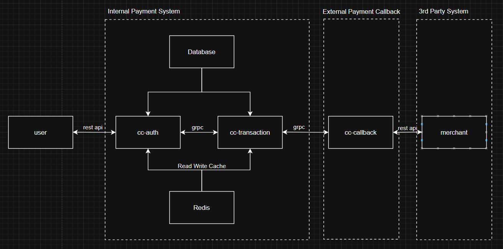
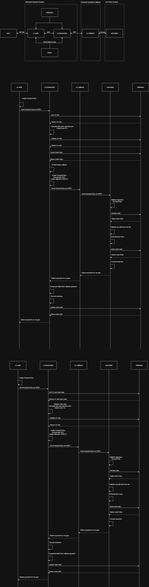

# Payment Microservices

## Techs: Golang (Gin), Postgres SQL, Redis

### Summary

This is a microservice project for buying the vouchers with creditcard.

For more detail regarding endpoints please use postman and import the payment-microservices.postman_collection file.

### Block Diagram



### Sequence Diagram



### Services:

- cc-auth : user's gateway for any action such as login, adding credit cards, inquiry, transaction, etc.
- cc-transaction : handling the transaction from the gateway.
- cc-callback : gateway for sending request to 3rd party merhant.
- merchant : 3rd party merchant which provides products.

### Note:

- Databases postgre and redis are already included within the containers, you dont need to setup anymore when using docker.
- Some requests require token, signature, or credit card info (generated when adding the credit card). Please refer to the postman file.
- To use the microservices you are required to register your email first and acquire the token using the login api.
- Before doing the transaction, make sure to add the products and discounts on merchant service, for more detail please refer to the postman file.

### if you are using docker:

Required:

1. Docker

How to run this project:

1. Build and Run the images and containers by entering the following command:

```
docker-compose up
```

### if you are not using docker:

Required:

1. Go version 1.19
2. Postgresql version 14
3. Redis

How to run this project:

1. Change the .env files according to your databases.
2. Run the following command in each services:

```
go run main.go
```
